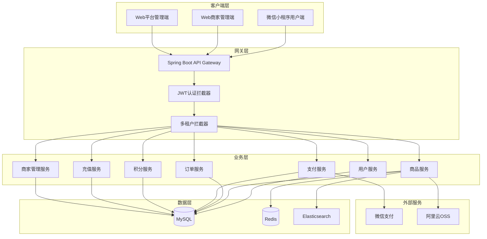
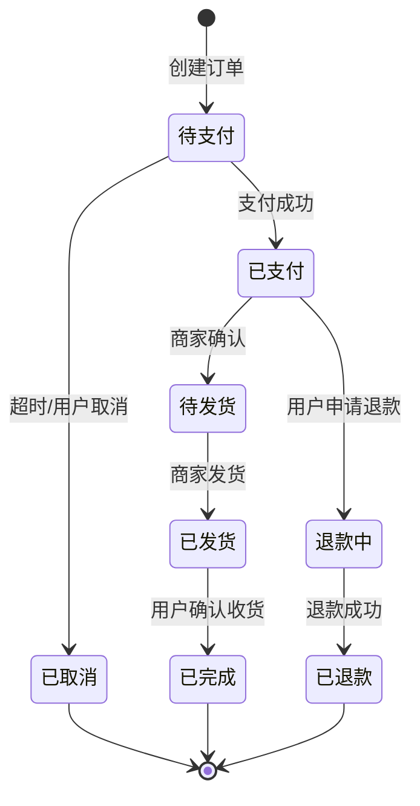
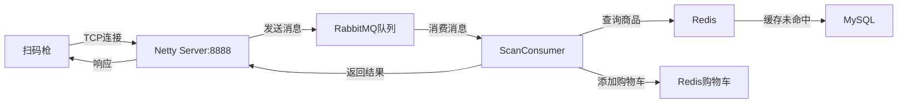
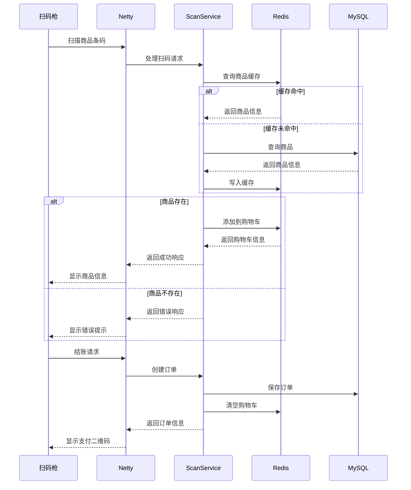
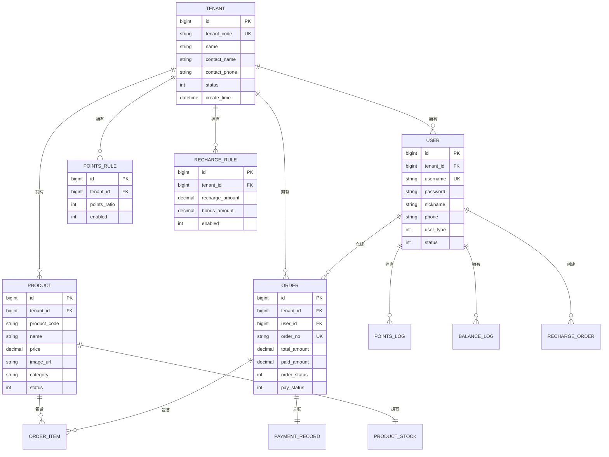

# 设计文档

## 概述

本系统是一个基于Spring Boot + Vue 3的多商户电商平台，采用SaaS模式，支持多个商家入驻并独立运营。系统包含微信小程序用户端、Web商家管理端和Web平台管理端三个客户端应用。

**核心特性：**
- 多租户架构，严格的数据隔离
- 微信小程序用户端
- 商家独立管理商品、订单、营销活动
- 积分和充值卡营销功能
- Redis缓存 + Elasticsearch搜索优化
- 微信支付集成

## 架构设计

### 系统架构图



### 技术栈

**后端：**
- Spring Boot 2.7.14
- MyBatis Plus 3.5.3.1（多租户插件）
- MySQL 8.0
- Redis（缓存）
- Elasticsearch（商品搜索）
- RabbitMQ（异步消息）
- JWT（认证）
- 微信支付SDK
- 阿里云OSS（图片存储）

**前端：**
- 微信小程序（用户端）
- Vue 3 + Element Plus（商家端、管理端）
- Vite
- Pinia（状态管理）
- Axios

## 核心组件和接口

### 1. 多租户管理组件

#### TenantContextHolder
```java
public class TenantContextHolder {
    private static final ThreadLocal<Long> TENANT_ID = new ThreadLocal<>();
    private static final ThreadLocal<String> TENANT_CODE = new ThreadLocal<>();
    
    public static void setTenantId(Long tenantId);
    public static Long getTenantId();
    public static void setTenantCode(String tenantCode);
    public static String getTenantCode();
    public static void clear();
}
```

#### JwtAuthInterceptor
- 从JWT token中提取租户信息
- 设置到TenantContextHolder
- 验证商家状态（是否被禁用）

#### MyBatisPlusTenantInterceptor
- 自动在所有SQL查询中添加 `tenant_id = ?` 条件
- 自动在插入数据时设置 `tenant_id`
- 排除不需要多租户隔离的表（tenant、sys_config等）

### 2. 商品管理组件

#### ProductService
```java
public interface ProductService {
    // 创建商品
    Product createProduct(ProductDTO dto, MultipartFile image);
    
    // 更新商品
    Product updateProduct(Long id, ProductDTO dto, MultipartFile image);
    
    // 删除商品（软删除）
    void deleteProduct(Long id);
    
    // 查询商品详情（先Redis后MySQL）
    Product getProductById(Long id);
    
    // 根据商品编码查询
    Product getProductByCode(String productCode);
    
    // 商品列表（分页）
    Page<Product> listProducts(ProductQueryDTO query);
    
    // 搜索商品（Elasticsearch）
    List<Product> searchProducts(String keyword, Long tenantId);
}
```

#### 商品缓存策略
- **缓存Key**: `product:{tenantId}:{productId}`
- **缓存时间**: 30分钟
- **缓存更新**: 商品更新或删除时清除缓存
- **查询流程**: 
  1. 先从Redis查询
  2. Redis未命中则从MySQL查询
  3. 查询结果写入Redis

#### 商品搜索策略（Elasticsearch）
- **索引名称**: `product_{tenantId}`
- **搜索字段**: 商品名称、商品编码、商品描述
- **搜索范围**: 仅搜索当前商家的商品
- **同步策略**: 商品创建/更新时同步到ES
- **搜索流程**:
  1. 用户在小程序搜索商品
  2. 调用ES搜索接口，传入关键词和tenantId
  3. ES返回商品ID列表
  4. 根据ID列表从Redis/MySQL获取完整商品信息

### 3. 订单管理组件

#### OrderService
```java
public interface OrderService {
    // 创建订单
    Order createOrder(OrderCreateDTO dto);
    
    // 订单支付
    PaymentResult payOrder(String orderNo, String payType);
    
    // 订单列表（用户端）
    Page<Order> listUserOrders(Long userId, OrderQueryDTO query);
    
    // 订单列表（商家端）
    Page<Order> listMerchantOrders(OrderQueryDTO query);
    
    // 订单详情
    Order getOrderDetail(String orderNo);
    
    // 订单发货
    void shipOrder(String orderNo, ShipDTO dto);
    
    // 取消订单
    void cancelOrder(String orderNo);
}
```

#### 订单状态流转


### 4. 积分管理组件

#### PointsService
```java
public interface PointsService {
    // 获取商家积分规则
    PointsRule getPointsRule(Long tenantId);
    
    // 设置商家积分规则
    void setPointsRule(PointsRuleDTO dto);
    
    // 计算订单积分
    Integer calculatePoints(BigDecimal amount, Long tenantId);
    
    // 发放积分
    void grantPoints(Long userId, Integer points, String reason, String orderNo);
    
    // 扣减积分
    void deductPoints(Long userId, Integer points, String reason);
    
    // 查询用户积分余额
    Integer getUserPoints(Long userId, Long tenantId);
    
    // 积分明细
    Page<PointsLog> listPointsLogs(Long userId, Long tenantId);
    
    // 积分兑换商品
    Order exchangeProduct(Long userId, Long exchangeProductId);
    
    // 设置积分兑换商品
    void setExchangeProduct(ExchangeProductDTO dto);
    
    // 积分兑换商品列表
    List<ExchangeProduct> listExchangeProducts(Long tenantId);
}
```

### 5. 充值管理组件

#### RechargeService
```java
public interface RechargeService {
    // 获取商家充值规则
    List<RechargeRule> getRechargeRules(Long tenantId);
    
    // 设置商家充值规则
    void setRechargeRules(List<RechargeRuleDTO> rules);
    
    // 创建充值订单
    RechargeOrder createRechargeOrder(Long userId, Long ruleId);
    
    // 充值支付回调
    void handleRechargeCallback(String orderNo);
    
    // 查询用户余额
    BigDecimal getUserBalance(Long userId, Long tenantId);
    
    // 使用余额支付
    void payWithBalance(String orderNo, BigDecimal amount);
    
    // 余额明细
    Page<BalanceLog> listBalanceLogs(Long userId, Long tenantId);
}
```

### 6. 商家管理组件

#### MerchantService
```java
public interface MerchantService {
    // 创建商家（租户）
    Tenant createMerchant(MerchantDTO dto);
    
    // 更新商家信息
    void updateMerchant(Long tenantId, MerchantDTO dto);
    
    // 启用商家
    void enableMerchant(Long tenantId);
    
    // 禁用商家
    void disableMerchant(Long tenantId);
    
    // 商家列表
    Page<Tenant> listMerchants(MerchantQueryDTO query);
    
    // 商家详情
    MerchantDetailVO getMerchantDetail(Long tenantId);
    
    // 审核提现申请
    void approveWithdrawal(Long withdrawalId);
    
    // 拒绝提现申请
    void rejectWithdrawal(Long withdrawalId, String reason);
}
```

### 7. 支付管理组件

#### PaymentService
```java
public interface PaymentService {
    // 创建支付订单（微信支付）
    WechatPayResult createWechatPay(String orderNo);
    
    // 微信支付回调
    void handleWechatCallback(String xmlData);
    
    // 查询支付状态
    PaymentStatus queryPaymentStatus(String orderNo);
    
    // 退款
    RefundResult refund(String orderNo, BigDecimal amount);
}
```

### 8. 扫码收银组件（Netty）

#### ScanService
```java
public interface ScanService {
    // 处理扫码请求
    ScanResult handleScan(ScanRequest request);
    
    // 查询商品（先Redis后MySQL）
    Product findProductByCode(String productCode, Long tenantId);
    
    // 添加到购物车
    void addToCart(String sessionId, Product product, Integer quantity);
    
    // 获取购物车
    List<CartItem> getCart(String sessionId);
    
    // 清空购物车
    void clearCart(String sessionId);
    
    // 创建收银订单
    Order createPosOrder(String sessionId, Long tenantId);
}
```

#### Netty服务器架构


#### 扫码请求协议
```json
{
  "action": "SCAN",
  "tenantCode": "TENANT_001",
  "deviceId": "POS-01",
  "sessionId": "session_123456",
  "productCode": "6901234567890",
  "quantity": 1
}
```

#### 扫码响应协议
```json
{
  "status": "SUCCESS",
  "message": "商品已添加到购物车",
  "data": {
    "productId": 1,
    "productCode": "6901234567890",
    "productName": "可乐500ml",
    "price": 3.50,
    "imageUrl": "https://...",
    "quantity": 1,
    "cartTotal": 2,
    "cartAmount": 7.00
  }
}
```

#### 购物车管理
- **存储方式**: Redis Hash
- **Key格式**: `cart:{sessionId}`
- **过期时间**: 30分钟（无操作自动清空）
- **数据结构**:
```json
{
  "productId_1": {
    "productId": 1,
    "productCode": "6901234567890",
    "productName": "可乐500ml",
    "price": 3.50,
    "quantity": 2
  }
}
```

#### 结账流程


## 数据模型

### 核心实体关系图



### 新增数据表

#### points_rule（积分规则表）
```sql
CREATE TABLE points_rule (
    id BIGINT PRIMARY KEY AUTO_INCREMENT,
    tenant_id BIGINT NOT NULL COMMENT '租户ID',
    points_ratio INT NOT NULL DEFAULT 1 COMMENT '积分比例（每消费1元获得的积分）',
    enabled TINYINT NOT NULL DEFAULT 0 COMMENT '是否启用（0-否，1-是）',
    create_time DATETIME DEFAULT CURRENT_TIMESTAMP,
    update_time DATETIME DEFAULT CURRENT_TIMESTAMP ON UPDATE CURRENT_TIMESTAMP,
    deleted TINYINT DEFAULT 0,
    UNIQUE KEY uk_tenant (tenant_id)
);
```

#### points_log（积分明细表）
```sql
CREATE TABLE points_log (
    id BIGINT PRIMARY KEY AUTO_INCREMENT,
    tenant_id BIGINT NOT NULL COMMENT '租户ID',
    user_id BIGINT NOT NULL COMMENT '用户ID',
    points INT NOT NULL COMMENT '积分变动（正数为增加，负数为扣减）',
    balance INT NOT NULL COMMENT '变动后余额',
    type VARCHAR(20) NOT NULL COMMENT '类型（GRANT-发放，DEDUCT-扣减）',
    reason VARCHAR(100) COMMENT '原因',
    order_no VARCHAR(50) COMMENT '关联订单号',
    create_time DATETIME DEFAULT CURRENT_TIMESTAMP,
    deleted TINYINT DEFAULT 0,
    INDEX idx_user_tenant (user_id, tenant_id),
    INDEX idx_order (order_no)
);
```

#### exchange_product（积分兑换商品表）
```sql
CREATE TABLE exchange_product (
    id BIGINT PRIMARY KEY AUTO_INCREMENT,
    tenant_id BIGINT NOT NULL COMMENT '租户ID',
    product_id BIGINT NOT NULL COMMENT '商品ID',
    points_required INT NOT NULL COMMENT '所需积分',
    stock INT NOT NULL DEFAULT 0 COMMENT '兑换库存',
    status TINYINT NOT NULL DEFAULT 1 COMMENT '状态（0-下架，1-上架）',
    create_time DATETIME DEFAULT CURRENT_TIMESTAMP,
    update_time DATETIME DEFAULT CURRENT_TIMESTAMP ON UPDATE CURRENT_TIMESTAMP,
    deleted TINYINT DEFAULT 0,
    INDEX idx_tenant (tenant_id)
);
```

#### recharge_rule（充值规则表）
```sql
CREATE TABLE recharge_rule (
    id BIGINT PRIMARY KEY AUTO_INCREMENT,
    tenant_id BIGINT NOT NULL COMMENT '租户ID',
    recharge_amount DECIMAL(10,2) NOT NULL COMMENT '充值金额',
    bonus_amount DECIMAL(10,2) NOT NULL COMMENT '赠送金额',
    enabled TINYINT NOT NULL DEFAULT 1 COMMENT '是否启用（0-否，1-是）',
    sort_order INT DEFAULT 0 COMMENT '排序',
    create_time DATETIME DEFAULT CURRENT_TIMESTAMP,
    update_time DATETIME DEFAULT CURRENT_TIMESTAMP ON UPDATE CURRENT_TIMESTAMP,
    deleted TINYINT DEFAULT 0,
    INDEX idx_tenant (tenant_id)
);
```

#### recharge_order（充值订单表）
```sql
CREATE TABLE recharge_order (
    id BIGINT PRIMARY KEY AUTO_INCREMENT,
    tenant_id BIGINT NOT NULL COMMENT '租户ID',
    user_id BIGINT NOT NULL COMMENT '用户ID',
    order_no VARCHAR(50) NOT NULL COMMENT '订单号',
    rule_id BIGINT NOT NULL COMMENT '充值规则ID',
    recharge_amount DECIMAL(10,2) NOT NULL COMMENT '充值金额',
    bonus_amount DECIMAL(10,2) NOT NULL COMMENT '赠送金额',
    total_amount DECIMAL(10,2) NOT NULL COMMENT '总金额',
    pay_status INT NOT NULL DEFAULT 0 COMMENT '支付状态（0-待支付，1-已支付）',
    pay_time DATETIME COMMENT '支付时间',
    create_time DATETIME DEFAULT CURRENT_TIMESTAMP,
    deleted TINYINT DEFAULT 0,
    UNIQUE KEY uk_order_no (order_no),
    INDEX idx_user_tenant (user_id, tenant_id)
);
```

#### balance_log（余额明细表）
```sql
CREATE TABLE balance_log (
    id BIGINT PRIMARY KEY AUTO_INCREMENT,
    tenant_id BIGINT NOT NULL COMMENT '租户ID',
    user_id BIGINT NOT NULL COMMENT '用户ID',
    amount DECIMAL(10,2) NOT NULL COMMENT '金额变动（正数为增加，负数为扣减）',
    balance DECIMAL(10,2) NOT NULL COMMENT '变动后余额',
    type VARCHAR(20) NOT NULL COMMENT '类型（RECHARGE-充值，CONSUME-消费）',
    reason VARCHAR(100) COMMENT '原因',
    order_no VARCHAR(50) COMMENT '关联订单号',
    create_time DATETIME DEFAULT CURRENT_TIMESTAMP,
    deleted TINYINT DEFAULT 0,
    INDEX idx_user_tenant (user_id, tenant_id),
    INDEX idx_order (order_no)
);
```

#### user_balance（用户余额表）
```sql
CREATE TABLE user_balance (
    id BIGINT PRIMARY KEY AUTO_INCREMENT,
    tenant_id BIGINT NOT NULL COMMENT '租户ID',
    user_id BIGINT NOT NULL COMMENT '用户ID',
    balance DECIMAL(10,2) NOT NULL DEFAULT 0 COMMENT '余额',
    total_recharge DECIMAL(10,2) NOT NULL DEFAULT 0 COMMENT '累计充值',
    total_consume DECIMAL(10,2) NOT NULL DEFAULT 0 COMMENT '累计消费',
    create_time DATETIME DEFAULT CURRENT_TIMESTAMP,
    update_time DATETIME DEFAULT CURRENT_TIMESTAMP ON UPDATE CURRENT_TIMESTAMP,
    deleted TINYINT DEFAULT 0,
    UNIQUE KEY uk_user_tenant (user_id, tenant_id)
);
```

#### user_points（用户积分表）
```sql
CREATE TABLE user_points (
    id BIGINT PRIMARY KEY AUTO_INCREMENT,
    tenant_id BIGINT NOT NULL COMMENT '租户ID',
    user_id BIGINT NOT NULL COMMENT '用户ID',
    points INT NOT NULL DEFAULT 0 COMMENT '积分余额',
    total_earned INT NOT NULL DEFAULT 0 COMMENT '累计获得',
    total_used INT NOT NULL DEFAULT 0 COMMENT '累计使用',
    create_time DATETIME DEFAULT CURRENT_TIMESTAMP,
    update_time DATETIME DEFAULT CURRENT_TIMESTAMP ON UPDATE CURRENT_TIMESTAMP,
    deleted TINYINT DEFAULT 0,
    UNIQUE KEY uk_user_tenant (user_id, tenant_id)
);
```

#### withdrawal（提现申请表）
```sql
CREATE TABLE withdrawal (
    id BIGINT PRIMARY KEY AUTO_INCREMENT,
    tenant_id BIGINT NOT NULL COMMENT '租户ID（商家）',
    amount DECIMAL(10,2) NOT NULL COMMENT '提现金额',
    bank_name VARCHAR(50) NOT NULL COMMENT '银行名称',
    bank_account VARCHAR(50) NOT NULL COMMENT '银行账号',
    account_name VARCHAR(50) NOT NULL COMMENT '账户名',
    status INT NOT NULL DEFAULT 0 COMMENT '状态（0-待审核，1-已通过，2-已拒绝）',
    reject_reason VARCHAR(200) COMMENT '拒绝原因',
    apply_time DATETIME DEFAULT CURRENT_TIMESTAMP COMMENT '申请时间',
    approve_time DATETIME COMMENT '审核时间',
    approver_id BIGINT COMMENT '审核人ID',
    create_time DATETIME DEFAULT CURRENT_TIMESTAMP,
    deleted TINYINT DEFAULT 0,
    INDEX idx_tenant (tenant_id),
    INDEX idx_status (status)
);
```

#### merchant_balance（商家余额表）
```sql
CREATE TABLE merchant_balance (
    id BIGINT PRIMARY KEY AUTO_INCREMENT,
    tenant_id BIGINT NOT NULL COMMENT '租户ID',
    balance DECIMAL(10,2) NOT NULL DEFAULT 0 COMMENT '可用余额',
    frozen_balance DECIMAL(10,2) NOT NULL DEFAULT 0 COMMENT '冻结余额',
    total_income DECIMAL(10,2) NOT NULL DEFAULT 0 COMMENT '累计收入',
    total_withdrawal DECIMAL(10,2) NOT NULL DEFAULT 0 COMMENT '累计提现',
    create_time DATETIME DEFAULT CURRENT_TIMESTAMP,
    update_time DATETIME DEFAULT CURRENT_TIMESTAMP ON UPDATE CURRENT_TIMESTAMP,
    deleted TINYINT DEFAULT 0,
    UNIQUE KEY uk_tenant (tenant_id)
);
```

#### pos_session（收银会话表）
```sql
CREATE TABLE pos_session (
    id BIGINT PRIMARY KEY AUTO_INCREMENT,
    tenant_id BIGINT NOT NULL COMMENT '租户ID',
    session_id VARCHAR(50) NOT NULL COMMENT '会话ID',
    device_id VARCHAR(50) NOT NULL COMMENT '设备ID',
    status INT NOT NULL DEFAULT 0 COMMENT '状态（0-进行中，1-已结账，2-已取消）',
    total_amount DECIMAL(10,2) DEFAULT 0 COMMENT '总金额',
    order_no VARCHAR(50) COMMENT '订单号',
    create_time DATETIME DEFAULT CURRENT_TIMESTAMP,
    update_time DATETIME DEFAULT CURRENT_TIMESTAMP ON UPDATE CURRENT_TIMESTAMP,
    expire_time DATETIME COMMENT '过期时间',
    deleted TINYINT DEFAULT 0,
    UNIQUE KEY uk_session (session_id),
    INDEX idx_tenant_device (tenant_id, device_id)
);
```

## 错误处理

### 异常分类
- **业务异常（BusinessException）**: 业务逻辑错误，如库存不足、余额不足
- **认证异常（AuthException）**: 认证失败、token过期
- **权限异常（PermissionException）**: 无权限访问
- **参数异常（ParamException）**: 参数校验失败

### 统一异常处理
```java
@RestControllerAdvice
public class GlobalExceptionHandler {
    @ExceptionHandler(BusinessException.class)
    public Result handleBusinessException(BusinessException e) {
        return Result.error(e.getCode(), e.getMessage());
    }
    
    @ExceptionHandler(AuthException.class)
    public Result handleAuthException(AuthException e) {
        return Result.error(401, e.getMessage());
    }
}
```

## 测试策略

### 单元测试
- Service层业务逻辑测试
- 工具类测试
- 使用Mockito模拟依赖

### 集成测试
- Controller层接口测试
- 数据库操作测试
- 使用Spring Boot Test

### 性能测试
- 商品搜索性能（Elasticsearch）
- 缓存命中率（Redis）
- 并发订单处理能力

### 测试数据
- 创建测试租户和测试用户
- 准备测试商品数据
- 模拟支付回调

## 安全考虑

### 认证和授权
- JWT token包含租户信息，防止跨租户访问
- 商家状态检查，禁用商家无法登录
- 管理员权限验证

### 数据安全
- 多租户数据严格隔离
- 敏感信息加密存储（密码、支付密钥）
- SQL注入防护（MyBatis Plus参数化查询）

### 接口安全
- 接口限流（防止恶意请求）
- 支付回调签名验证
- HTTPS传输（生产环境）

## 性能优化

### 缓存策略
- **商品信息缓存**: Redis缓存热门商品，30分钟过期
- **用户信息缓存**: Redis缓存用户基本信息，1小时过期
- **积分余额缓存**: Redis缓存用户积分，实时更新
- **充值规则缓存**: Redis缓存商家充值规则，1天过期

### 数据库优化
- 索引优化（tenant_id、user_id、order_no等）
- 分页查询（避免全表扫描）
- 读写分离（主从复制）
- 连接池配置（Druid）

### 搜索优化
- Elasticsearch商品搜索
- 分词器配置（中文分词）
- 搜索结果缓存

### 异步处理
- RabbitMQ异步处理订单
- 异步发送通知消息
- 异步更新统计数据

## 部署架构

### 开发环境
- 单机部署
- 本地MySQL、Redis、Elasticsearch
- 微信支付沙箱环境

### 生产环境
- 负载均衡（Nginx）
- MySQL主从复制
- Redis集群
- Elasticsearch集群
- Docker容器化部署
- 日志收集（ELK）
- 监控告警（Prometheus + Grafana）
