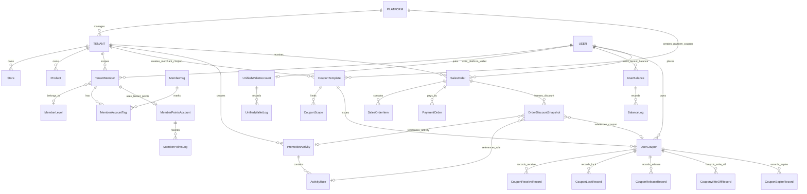
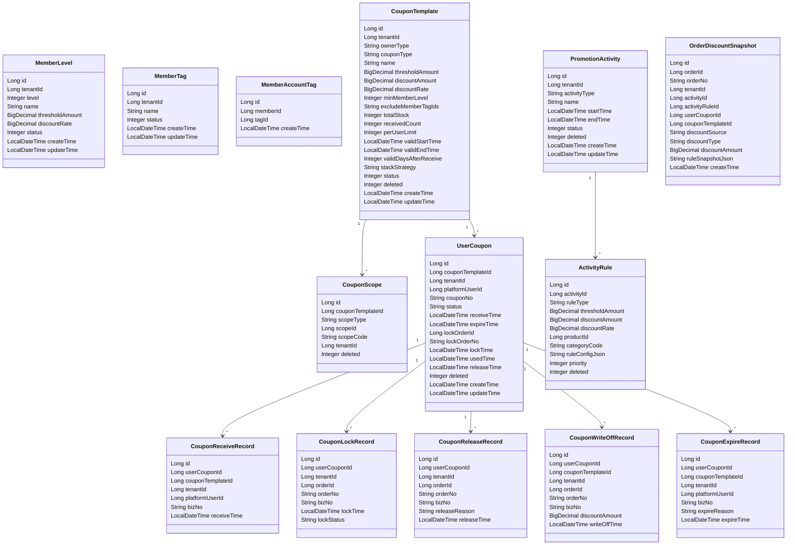
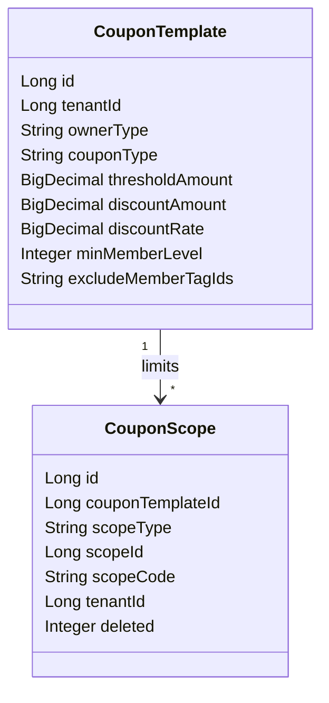
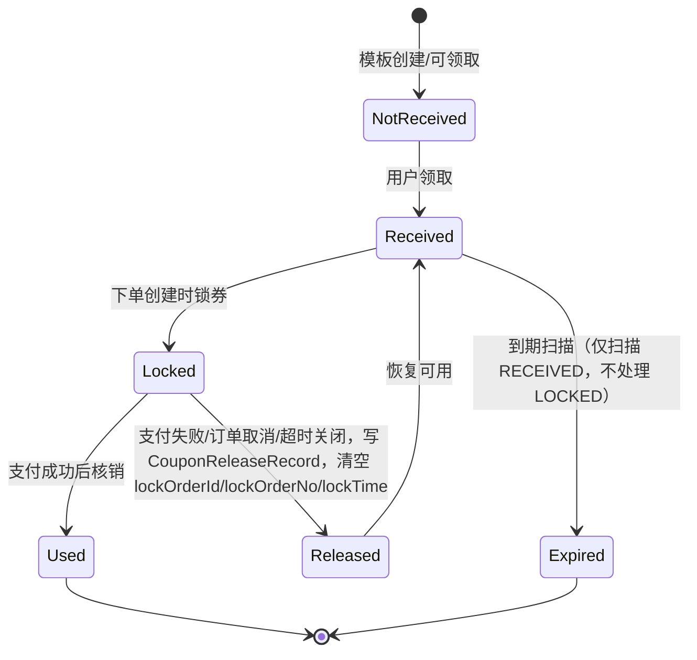
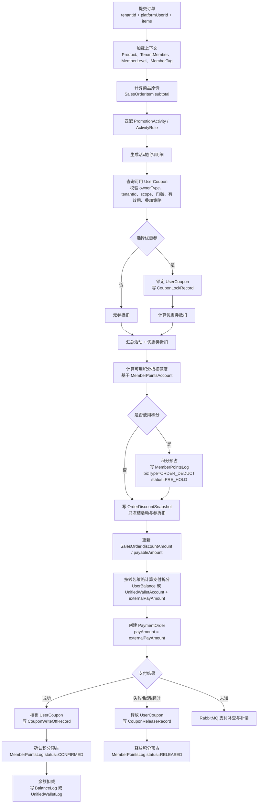
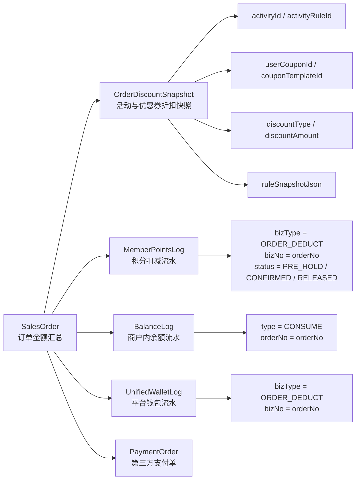
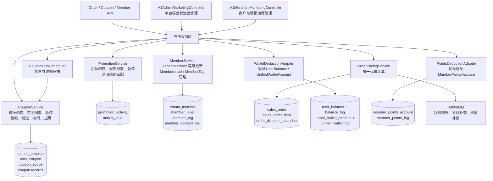

# 优惠券、活动、会员运营领域模型图

本文档基于当前 `payment-system` 已有实体修正，避免在优惠券/活动/会员模块中重复造会员、积分、余额、订单体系。

## 1. 实体对齐结论

| 领域概念 | 当前实现选择 | 类型 | 说明 |
| --- | --- | --- | --- |
| 租户会员 | `TenantMember` | 复用 | 会员等级、标签后续挂到该实体。 |
| 会员等级 | `MemberLevel` | 新建 | 租户内等级规则，`TenantMember.memberLevel` 存等级数值。 |
| 会员标签 | `MemberTag` + `MemberAccountTag` | 新建 | 标签本身租户内管理，会员与标签用中间表关联。 |
| 门店 | `Store` | 复用 | 原图里的 `SHOP` 改为现有 `Store`。 |
| 商品 | `Product` | 复用 | 当前分类是 `Product.category` 字符串，不存在独立分类表。 |
| 销售订单 | `SalesOrder` + `SalesOrderItem` | 复用 | 承载订单主数据和商品明细。 |
| 支付单 | `PaymentOrder` | 复用 | 承载支付渠道、支付金额、支付状态。 |
| 租户级积分 | `MemberPointsAccount` + `MemberPointsLog` | 优先复用 | 新链路建议优先用这套，语义更贴近租户会员。 |
| 旧积分 | `UserPoints` + `PointsLog` | 保留/待迁移 | 旧链路仍存在，避免优惠券模块继续扩大两套积分并存。 |
| 商户内余额 | `UserBalance` + `BalanceLog` | 复用旧链路 | 适合“某商户充值余额只在该商户使用”。 |
| 平台统一钱包 | `UnifiedWalletAccount` + `UnifiedWalletLog` | 复用新链路 | 适合平台级钱包/统一余额。 |
| 商户经营余额 | `MerchantBalance` | 复用 | 商户收入、提现侧余额，不作为用户下单抵扣账户。 |
| 优惠券模板 | `CouponTemplate` | 新建 | 平台券、商户券的规则来源。 |
| 用户券 | `UserCoupon` | 新建 | 用户领取后形成的个人券资产。 |
| 优惠券范围 | `CouponScope` | 新建 | 采用 `scopeType + scopeId/scopeCode`，不做四种外键。 |
| 券操作记录 | `CouponReceiveRecord` / `CouponLockRecord` / `CouponReleaseRecord` / `CouponWriteOffRecord` / `CouponExpireRecord` | 新建 | 领取、锁定、释放、核销、过期全链路审计。 |
| 活动 | `PromotionActivity` + `ActivityRule` | 新建 | 商户/平台活动规则。 |
| 优惠快照 | `OrderDiscountSnapshot` | 新建 | 只冻结活动和优惠券折扣明细，不承载积分/余额流水。 |

## 2. 核心领域关系

## 3. 新建与复用边界

```mermaid
flowchart TB
    A["优惠券/活动/会员运营"] --> B["复用已有实体"]
    A --> C["本期新建实体"]
    A --> D["实现前选型点"]

    B --> B1["TenantMember<br/>租户会员"]
    B --> B2["Store / Product<br/>门店与商品"]
    B --> B3["SalesOrder / SalesOrderItem / PaymentOrder<br/>订单与支付单"]
    B --> B4["MemberPointsAccount / MemberPointsLog<br/>租户级积分"]
    B --> B5["UserBalance / BalanceLog<br/>商户内余额"]
    B --> B6["UnifiedWalletAccount / UnifiedWalletLog<br/>平台统一钱包"]

    C --> C1["CouponTemplate<br/>优惠券模板"]
    C --> C2["UserCoupon<br/>用户券"]
    C --> C3["CouponScope<br/>scopeType + scopeId/scopeCode"]
    C --> C4["CouponReceiveRecord / CouponLockRecord<br/>CouponReleaseRecord / CouponWriteOffRecord<br/>CouponExpireRecord"]
    C --> C5["PromotionActivity / ActivityRule"]
    C --> C6["MemberLevel / MemberTag / MemberAccountTag"]
    C --> C7["OrderDiscountSnapshot<br/>仅冻结活动与券折扣"]

    D --> D1["积分优先选 MemberPointsAccount<br/>不继续扩大 UserPoints"]
    D --> D2["余额按场景选择<br/>商户内余额 UserBalance<br/>平台钱包 UnifiedWalletAccount"]
    D --> D3["Product.category 当前是字符串<br/>分类范围用 scopeCode"]
```

## 4. 新建实体字段定义

字段定义先服务第一版建表，后续可以在不改变主关系的前提下补审计字段、创建人、更新人等通用列。

字段语义约定：

- `MemberLevel.level` 是租户内等级数值，例如 `1、2、3`，等级越高权益越高。
- `CouponTemplate.minMemberLevel` 存等级数值，不存 `MemberLevel.id`，避免等级配置重建后影响券规则判断。
- `CouponTemplate.excludeMemberTagIds` 存逗号分隔的 `MemberTag.id`，例如 `12,18,31`，应用层拆分校验。
- `CouponTemplate.ownerType` 使用 `PLATFORM` / `TENANT`。
- `UserCoupon.status` 使用状态机枚举，见下文。
- `CouponReleaseRecord` 独立记录释放原因；`CouponLockRecord.lockStatus` 只表达锁定记录自身状态。
- `CouponExpireRecord` 独立记录过期原因；过期扫描和 MQ 补偿都应使用 `bizNo` 保证幂等。

## 5. CouponScope 简化模型

`CouponScope` 不直接外键关联 `Tenant`、`Product`、分类、`User` 四张目标表，而是采用统一范围行。

推荐 `scopeType`：

- `TENANT`：指定商户，`scopeId = tenantId`
- `PRODUCT`：指定商品，`scopeId = productId`
- `CATEGORY`：指定商品分类，`scopeCode = Product.category`
- `USER`：指定用户，`scopeId = platformUserId`

会员等级、会员标签筛选优先放在 `CouponTemplate` 的领取/使用规则字段里，不全部塞进 `CouponScope`。

## 6. 枚举定义

### CouponType

| 枚举值 | 含义 |
| --- | --- |
| `FULL_REDUCTION` | 满减券，例如满 100 减 20。 |
| `DISCOUNT_RATE` | 折扣券，例如 8.5 折。 |
| `NO_THRESHOLD` | 无门槛券。 |
| `RECHARGE_GIFT` | 充值赠券。 |

### ActivityType

| 枚举值 | 含义 |
| --- | --- |
| `FLASH_SALE` | 限时特价。 |
| `MEMBER_PRICE` | 会员价。 |
| `BUY_X_GET_Y` | 买赠活动。 |
| `FULL_REDUCTION` | 活动满减。 |
| `DISCOUNT_RATE` | 活动折扣。 |

### UserCouponStatus

| 枚举值 | 含义 |
| --- | --- |
| `RECEIVED` | 已领取，可使用。 |
| `LOCKED` | 已被订单锁定。 |
| `USED` | 已核销。 |
| `RELEASED` | 已释放，释放后业务状态恢复为 `RECEIVED`。 |
| `EXPIRED` | 已过期。 |

### PointsDeductStatus

现有 `MemberPointsLog` 没有状态字段。若下单链路要支持积分预占，需要给 `MemberPointsLog` 增加 `status` 字段，或新增独立 `MemberPointsHoldRecord`。本期建议先扩展 `MemberPointsLog.status`：

| 枚举值 | 含义 |
| --- | --- |
| `PRE_HOLD` | 下单时预占积分。 |
| `CONFIRMED` | 支付成功后确认扣减。 |
| `RELEASED` | 支付失败、取消、超时后释放预占。 |

## 7. 用户券状态机

> **变更说明（2026-06-04）**：移除 `Locked → Expired` 直接过期路径。LOCKED 券只能由订单事件（核销/释放）驱动状态迁移，过期扫描只处理 RECEIVED 券，避免与支付回调并发冲突。

## 8. 下单优惠计算链路

## 9. 快照与流水职责拆分

`OrderDiscountSnapshot` 只解决一个问题：历史订单里的活动和优惠券为什么减了这些钱。积分和余额是资产变动，继续走已有日志体系。

## 10. 服务分层建议

## 11. 实现前必须拍板的两个选型

### 积分体系

建议本期优惠券/会员运营优先使用：

- `MemberPointsAccount`
- `MemberPointsLog`
- 关联键：`tenantId + platformUserId`
- 订单关联：`bizType + bizNo(orderNo)`

`UserPoints` / `PointsLog` 保留给旧接口，后续单独做迁移或兼容层，避免新模块继续增加两套积分写入。

积分预占需要在实现前二选一：

- 扩展 `MemberPointsLog.status`、`confirmTime`、`releaseTime`、`releaseReason` 字段。
- 或新增 `MemberPointsHoldRecord`，日志继续保持纯流水。

本期为了少建一套表，建议先扩展 `MemberPointsLog`。

### 余额体系

按业务场景分开，不新增第四套余额：

- 商户内充值余额：继续使用 `UserBalance` + `BalanceLog`
- 平台统一钱包：继续使用 `UnifiedWalletAccount` + `UnifiedWalletLog`
- 商户经营余额：继续使用 `MerchantBalance`，只处理商户收入/提现，不参与用户抵扣

下单计算服务只输出抵扣计划，真正扣款由钱包适配层根据 `SalesOrder.walletStrategy` 执行。

## 12. 关键落库原则

- 优惠券模板定义规则，用户券承载个人状态。
- 优惠券模板和营销活动默认先落 `DRAFT`，必须显式启用后才能参与领取和下单计算。
- 商户端营销运营入口为 `/v1/merchant/tenants/{tenantId}/marketing`，控制器只做员工身份校验、租户注入和服务编排。
- 平台端营销运营入口为 `/v1/admin/marketing`，只管理 `ownerType = PLATFORM` 的平台券和平台活动，使用 `admin:marketing:*` 权限保护。
- `12_rbac_permission.sql` 初始化 `admin:marketing:list`、`admin:marketing:create`、`admin:marketing:update`，并授予管理员角色。
- 商户券默认受 `tenantId` 隔离；平台券 `user_coupon.tenant_id = null`，查询和操作均跳过租户校验，但下单时需按模板 scope 判断当前商户是否可用。
- 领券使用 `UserCouponMapper.claimCouponSlot` 原子 SQL 同时约束库存和每人限领，顺序为先抢占后插入。
- `UserCoupon`、`CouponTemplate`、`MemberPointsAccount` 三个实体的 `version` 字段均加 `@Version`，`updateById` 必须检查 affected rows，返回 0 时抛异常或跳过。
- `releaseCoupon` 必须校验 `platformUserId`（`ensureUser`）+ `lockOrderId` 匹配，释放后清空 lock 字段。
- `expireCoupons` 只扫描 `RECEIVED` 状态，不处理 `LOCKED` 券；支持可选 `tenantId` 参数限定租户范围。释放和过期时均清空 `lockOrderId` / `lockOrderNo` / `lockTime`。
- 积分算术使用 `Math.addExact` / `Math.subtractExact` 防溢出。
- 所有秘钥通过 `${ENV_VAR:}` 引用，本地开发存于 `application-dev.yml`（不入 Git）。
- `CouponScope` 使用 `scopeType + scopeId/scopeCode`，不要做多目标外键表。
- `Product` 当前没有分类实体，分类适用范围先按 `Product.category` 字符串匹配。
- `OrderDiscountSnapshot` 只冻结活动和优惠券折扣，不记录积分/余额扣减。
- 积分扣减复用 `MemberPointsLog`，但需要补 `status` 才能支持预占、确认、释放。
- 余额扣减复用 `BalanceLog` / `UnifiedWalletLog`。
- 券领取、锁定、释放、核销、过期都要有记录，方便审计和 RabbitMQ 补偿。
- `CouponTaskScheduler` 负责周期性过期扫描；RabbitMQ 负责超时释放、支付结果补查、核销失败补偿；幂等仍要靠业务唯一键、状态机和唯一索引共同保证。
